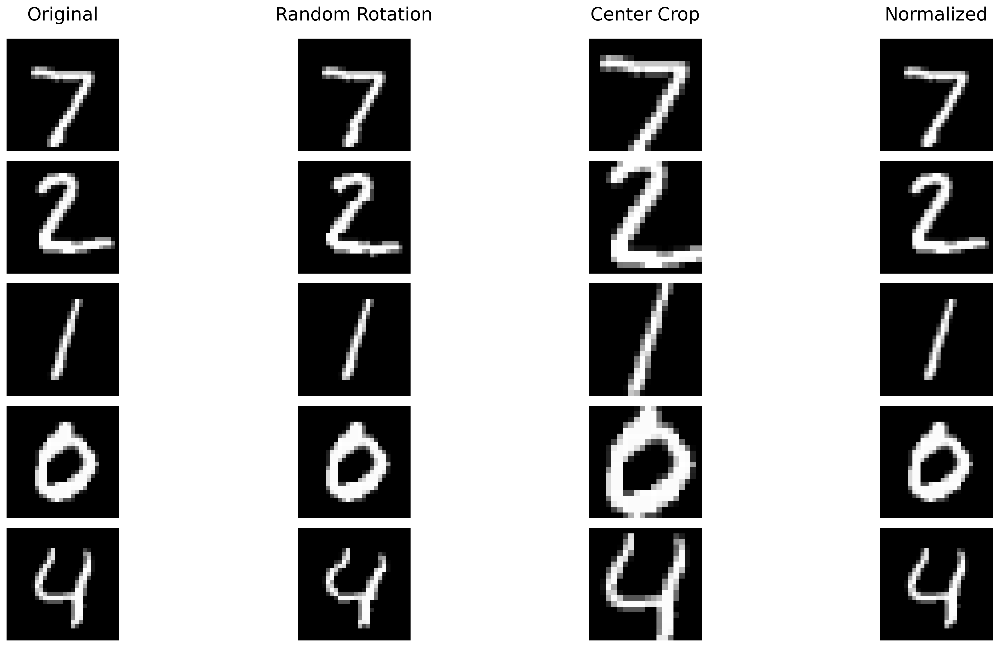
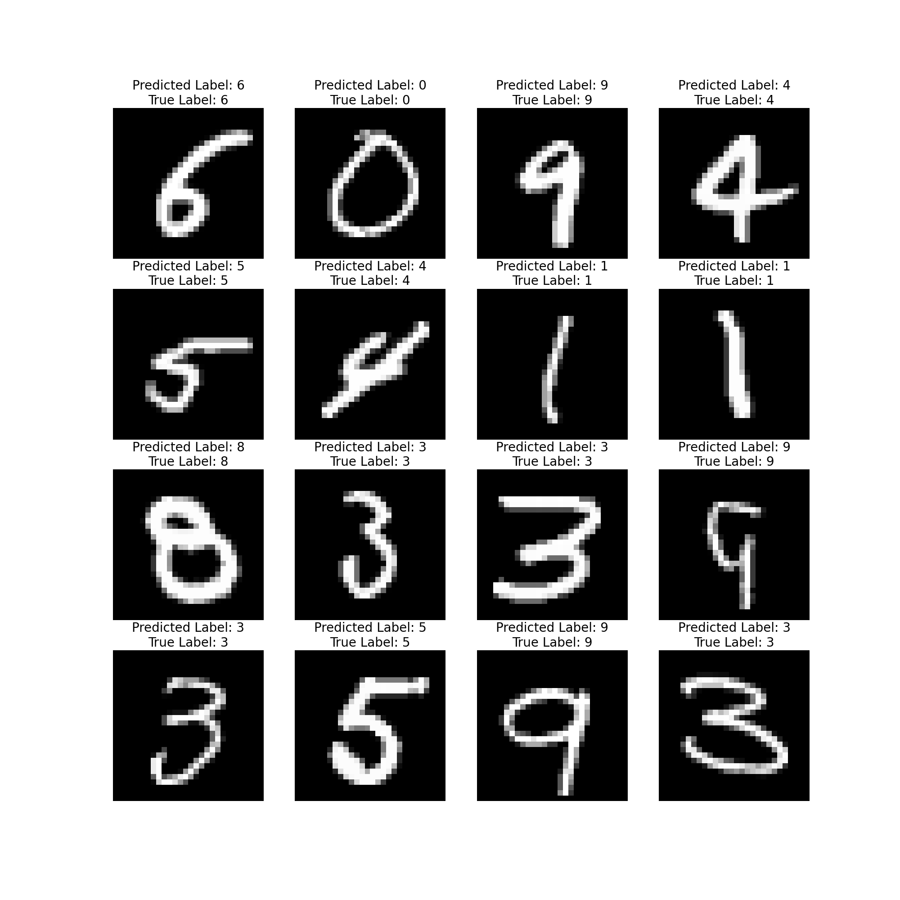

# MNIST Model Training


- [Problem Statement](#Problem-Statement)
- [File Structure](#File-Structure)
- [Model Parameters](#Model-Parameters)
- [Training Logs](#Training-Logs)
- [Results](#Results)
  * [Sample Output](#Sample-Output)
  * [Misclassified Images](#Misclassified-Images)
  * [Accuracy Report for Each class](#Accuracy-Report-for-Each-class)

# Problem Statement
Training a CNN model on MNIST dataset with GitHub Actions integration for automated testing and deployment.

# File Structure
* [model.py](https://github.com/deepanshudashora/MNIST_github_actions/blob/main/model.py) - Contains Model Architecture
* [utils.py](https://github.com/deepanshudashora/MNIST_github_actions/blob/main/utils.py) - Contains training utilities and helper functions
* [tests/](https://github.com/deepanshudashora/MNIST_github_actions/tree/main/tests) - Test files directory
* [images/](https://github.com/deepanshudashora/MNIST_github_actions/tree/main/images) - Generated plots and visualizations
* [.github/workflows/](https://github.com/deepanshudashora/MNIST_github_actions/tree/main/.github/workflows) - GitHub Actions workflow file
* [train.ipynb](https://github.com/deepanshudashora/MNIST_github_actions/blob/main/train.ipynb) - DEMO Training of the model
* [train.py](https://github.com/deepanshudashora/MNIST_github_actions/blob/main/train.py) - Training script for actions

# Model Parameters
```python
----------------------------------------------------------------
        Layer (type)               Output Shape         Param #
================================================================
            Conv2d-1            [-1, 4, 26, 26]              36
              ReLU-2            [-1, 4, 26, 26]               0
       BatchNorm2d-3            [-1, 4, 26, 26]               8
           Dropout-4            [-1, 4, 26, 26]               0
            Conv2d-5           [-1, 10, 24, 24]             360
              ReLU-6           [-1, 10, 24, 24]               0
       BatchNorm2d-7           [-1, 10, 24, 24]              20
           Dropout-8           [-1, 10, 24, 24]               0
         MaxPool2d-9           [-1, 10, 12, 12]               0
           Conv2d-10            [-1, 8, 12, 12]              80
             ReLU-11            [-1, 8, 12, 12]               0
      BatchNorm2d-12            [-1, 8, 12, 12]              16
          Dropout-13            [-1, 8, 12, 12]               0
           Conv2d-14            [-1, 4, 12, 12]              32
             ReLU-15            [-1, 4, 12, 12]               0
      BatchNorm2d-16            [-1, 4, 12, 12]               8
          Dropout-17            [-1, 4, 12, 12]               0
           Conv2d-18           [-1, 10, 10, 10]             360
             ReLU-19           [-1, 10, 10, 10]               0
      BatchNorm2d-20           [-1, 10, 10, 10]              20
          Dropout-21           [-1, 10, 10, 10]               0
           Conv2d-22             [-1, 16, 8, 8]           1,440
             ReLU-23             [-1, 16, 8, 8]               0
      BatchNorm2d-24             [-1, 16, 8, 8]              32
          Dropout-25             [-1, 16, 8, 8]               0
           Conv2d-26             [-1, 12, 6, 6]           1,728
             ReLU-27             [-1, 12, 6, 6]               0
      BatchNorm2d-28             [-1, 12, 6, 6]              24
          Dropout-29             [-1, 12, 6, 6]               0
           Conv2d-30             [-1, 16, 4, 4]           1,728
             ReLU-31             [-1, 16, 4, 4]               0
      BatchNorm2d-32             [-1, 16, 4, 4]              32
          Dropout-33             [-1, 16, 4, 4]               0
        AvgPool2d-34             [-1, 16, 1, 1]               0
           Conv2d-35             [-1, 10, 1, 1]             160
================================================================
Total params: 6,084
Trainable params: 6,084
Non-trainable params: 0
----------------------------------------------------------------
Input size (MB): 0.00
Forward/backward pass size (MB): 0.40
Params size (MB): 0.02
Estimated Total Size (MB): 0.43
----------------------------------------------------------------
```
# Training Logs
```
Training: 100%|██████████| 938/938 [00:39<00:00, 23.51it/s, Loss=0.0079, Accuracy=93.67%]
Training Progress: 100%|██████████| 1/1 [00:45<00:00, 45.05s/it, Train Loss=0.2454, Test Loss=0.0506, Train Acc=93.67%, Test Acc=98.50%]
Test set: Average loss: 0.0506, Accuracy: 9850/10000 (98.50%)

```

# Data Augmentation

⚠️ **Note**: For visualization purposes, the data augmentation transformations (e.g., angle rotation and center crop) are applied with exaggerated values compared to the actual values used during training. This is done to make the visual differences more noticeable. The original values were too subtle for clear visual representation.

### Visualization Example
<p align="center">
  
</p>

#### Key Differences
| Transformation       | Training Values                | Visualization Values          |
|-----------------------|--------------------------------|--------------------------------|
| **Rotation Angle**   | `-5.0` to `5.0`               | `-10.0` to `10.0`             |
| **Center Crop Size** | `24x24`                       | `20x20`                       |

The adjustments ensure that the visualization highlights the effects of the transformations clearly. These changes are not used during the actual training process.
--- 

# Results

## Sample Output
<p align="center">
  
</p>

## Misclassified Images
<p align="center">
  
</p>

## Accuracy Report for Each class
<p align="center">
  
</p>

```json
{' zero': 98.77300613496932,
 ' one': 98.37837837837837,
 ' two': 97.0059880239521,
 ' three': 100.0,
 ' four': 97.91666666666667,
 ' five': 99.1869918699187,
 ' six': 98.70967741935483,
 ' seven': 98.93048128342247,
 ' eight': 96.18320610687023,
 ' nine': 97.24137931034483}
```

## GitHub Actions Details
* use [uv](https://astral.sh/blog/uv) instead of pip for faster installation of dependencies
* run test cases before training the model
* run test cases after training the model

