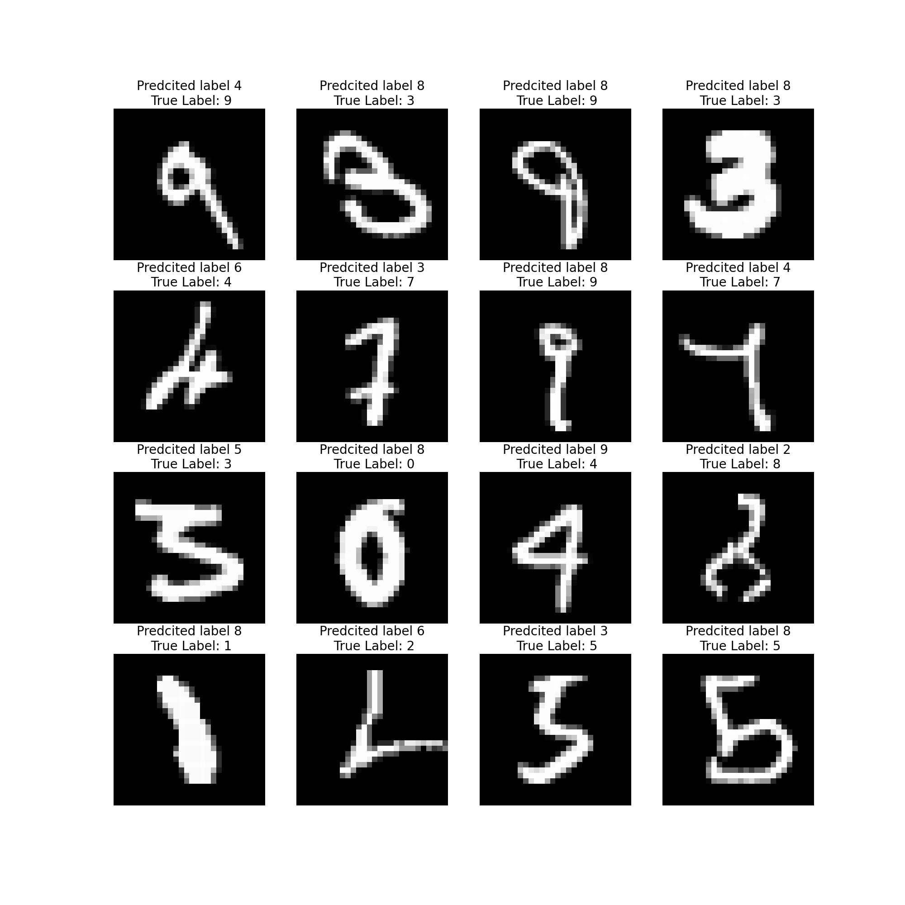

# MNIST Model Training


- [Problem Statement](#Problem-Statement)
- [File Structure](#File-Structure)
- [Model Parameters](#Model-Parameters)
- [Training Logs](#Training-Logs)
- [Results](#Results)
  * [Accuracy Plot](#Accuracy-Plot)
  * [Sample Output](#Sample-Output)
  * [Misclassified Images](#Misclassified-Images)
  * [Accuracy Report for Each class](#Accuracy-Report-for-Each-class)

# Problem Statement
Training a CNN model on MNIST dataset with GitHub Actions integration for automated testing and deployment.

# File Structure
* model.py - Contains Model Architecture
* utils.py - Contains training utilities and helper functions
* src/ - Source code directory
* tests/ - Test files directory
* logs/ - Training logs and metrics
* images/ - Generated plots and visualizations

# Model Parameters
```python
----------------------------------------------------------------
        Layer (type)               Output Shape         Param #
================================================================
            Conv2d-1            [-1, 4, 26, 26]              36
              ReLU-2            [-1, 4, 26, 26]               0
       BatchNorm2d-3            [-1, 4, 26, 26]               8
           Dropout-4            [-1, 4, 26, 26]               0
            Conv2d-5           [-1, 10, 24, 24]             360
              ReLU-6           [-1, 10, 24, 24]               0
       BatchNorm2d-7           [-1, 10, 24, 24]              20
           Dropout-8           [-1, 10, 24, 24]               0
         MaxPool2d-9           [-1, 10, 12, 12]               0
           Conv2d-10            [-1, 8, 12, 12]              80
             ReLU-11            [-1, 8, 12, 12]               0
      BatchNorm2d-12            [-1, 8, 12, 12]              16
          Dropout-13            [-1, 8, 12, 12]               0
           Conv2d-14            [-1, 4, 12, 12]              32
             ReLU-15            [-1, 4, 12, 12]               0
      BatchNorm2d-16            [-1, 4, 12, 12]               8
          Dropout-17            [-1, 4, 12, 12]               0
           Conv2d-18           [-1, 10, 10, 10]             360
             ReLU-19           [-1, 10, 10, 10]               0
      BatchNorm2d-20           [-1, 10, 10, 10]              20
          Dropout-21           [-1, 10, 10, 10]               0
           Conv2d-22             [-1, 16, 8, 8]           1,440
             ReLU-23             [-1, 16, 8, 8]               0
      BatchNorm2d-24             [-1, 16, 8, 8]              32
          Dropout-25             [-1, 16, 8, 8]               0
           Conv2d-26             [-1, 12, 6, 6]           1,728
             ReLU-27             [-1, 12, 6, 6]               0
      BatchNorm2d-28             [-1, 12, 6, 6]              24
          Dropout-29             [-1, 12, 6, 6]               0
           Conv2d-30             [-1, 16, 4, 4]           1,728
             ReLU-31             [-1, 16, 4, 4]               0
      BatchNorm2d-32             [-1, 16, 4, 4]              32
          Dropout-33             [-1, 16, 4, 4]               0
        AvgPool2d-34             [-1, 16, 1, 1]               0
           Conv2d-35             [-1, 10, 1, 1]             160
================================================================
Total params: 6,084
Trainable params: 6,084
Non-trainable params: 0
----------------------------------------------------------------
Input size (MB): 0.00
Forward/backward pass size (MB): 0.40
Params size (MB): 0.02
Estimated Total Size (MB): 0.43
----------------------------------------------------------------
```
# Training Logs
```
Training: 100%|██████████| 938/938 [00:39<00:00, 23.51it/s, Loss=0.0079, Accuracy=93.67%]
Training Progress: 100%|██████████| 1/1 [00:45<00:00, 45.05s/it, Train Loss=0.2454, Test Loss=0.0506, Train Acc=93.67%, Test Acc=98.50%]
Test set: Average loss: 0.0506, Accuracy: 9850/10000 (98.50%)

```
# Results

## Accuracy Plot


## Sample Output


## Misclassified Images


## Accuracy Report for Each class


```json
{' zero': 98.77300613496932,
 ' one': 98.37837837837837,
 ' two': 97.0059880239521,
 ' three': 100.0,
 ' four': 97.91666666666667,
 ' five': 99.1869918699187,
 ' six': 98.70967741935483,
 ' seven': 98.93048128342247,
 ' eight': 96.18320610687023,
 ' nine': 97.24137931034483}
```
